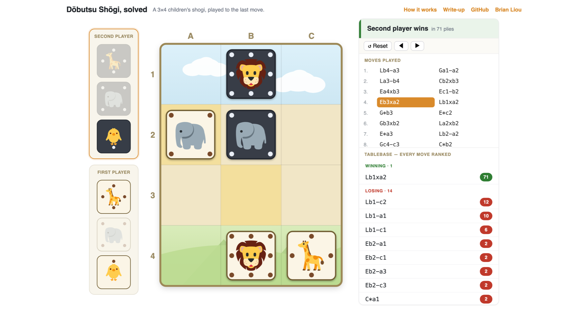

# dobutsu-shogi

<p align="center">
  <a href="https://dobutsu.brianhliou.com">
    
  </a>
</p>

A scientific analysis of **Dōbutsu Shōgi** (どうぶつしょうぎ / "Let's Catch the Lion!") and its
complete solution, working from the primary source toward a rigorous, well-cited **English
article** — the explainer the topic has lacked.

**Live:** explorer → **<https://dobutsu.brianhliou.com>** ·
article → **<https://brianhliou.com/posts/dobutsu-shogi/>**

Dōbutsu Shōgi is a 3×4, 8-piece children's shogi variant designed in 2008 by professional
player Madoka Kitao, and **strongly solved** by Tetsuro Tanaka (University of Tokyo) in 2009.
Its surprising depth comes from shogi's **drop rule** — captured pieces switch sides and return
to play — the same twist that makes it interesting as a design study.

## Why this repo exists

No English-language piece works through Tanaka's actual analysis — coverage is either
rules-and-history or a short encyclopedia summary. This repo fills that gap: a
primary-source-grounded explainer that gets the math right and shows *why* such a small game
runs so deep.

Getting the math right matters, because one figure is easy to conflate. The often-cited
**1,567,925,964** is Tanaka's *upper bound on all piece arrangements ignoring reachability*
(Table 1); the number of positions actually **reachable** from the start is **246,803,167**
(§3.1). The larger number had propagated into several references as the count of "reachable
positions" — we use the correct figure throughout, and contributed the correction, with the
primary-source citation, back to Wikipedia.

## How it's solved

The solve is reproduced from scratch in Rust (`solver/`), not taken on faith:

- **213,993,386** canonical positions (turn + mirror symmetry folded) enumerated and labeled by
  **retrograde analysis** — backward induction from terminal positions. Enumerating with Tanaka's
  +1-ply Try convention reproduces his exact reachable count, **246,803,167** (**99,485,568**
  non-terminal). The initial position evaluates to **−78** (gote win in 78); the deepest forced
  mate is 173 plies.
- Packed into a **333 MB** compact tablebase (minimal perfect hash + 9-bit distances) — this is
  what the live explorer probes.
- **Validated** against the independent clausecker/dobutsu engine: **0 mismatches** on a
  50,000-position sample.
- **Compact and fast.** The first solve used a `HashMap` over ~8 GB and ran ~75 min. Porting
  clausecker's computed position index (ownership × cohort × lion × placement) lets the same
  retrograde run over a flat **243 MB** byte array in **~3.5 min** — smaller *and* faster, because
  gigabyte-scale random access is cache-hostile while a contiguous computed index is not. It
  covers the full all-legal domain (clausecker's, not just reachable-from-start) and matches his
  values to the ply: **0 mismatches** over a ~4,900-position sample against his probe. The last
  1.5× to his exact 167 MB is his Sente≥Gote ownership fold, not yet ported.
- **Drops ablation:** re-solving with captured pieces removed (chess-style) collapses the game
  to a **37-ply draw** — direct evidence that the drop rule is what makes it deep.

### Run stats

These are the saved resource numbers for the solve and the tablebases:

| Run / artifact | Resource use | Time | Output |
|---|---:|---:|---:|
| Tanaka 2009 solve | 2.6 GHz Opteron, 16 GB RAM | ~19 min enumeration, ~5.5 hr retrograde | published value table |
| clausecker reproduction | ~256 MB peak RSS | <1 min | `dobutsu.tb`, 167,527,962 bytes (160 MiB) |
| Rust standard solve (`solve`) | ~7 GB RAM | ~75 min serial, ~17 min parallel | `solver/dobutsu.tb.bin`, 2,139,933,860 bytes (2.0 GiB) |
| Rust dense solve (`solvedense`) | 243 MB array (635 MB peak) | ~3.5 min | in-memory DTM over all legal positions, 0 mismatches vs probe |
| Compact tablebase | `ctbprobe` holds ~400 MB resident | compact timing not recorded | `solver/dobutsu.ctb`, 332,892,892 bytes (317 MiB) |

```sh
cd solver
cargo test
echo 'S/gle/-c-/-C-/ELG/-' | cargo run --quiet   # legal moves + resulting positions
```

## Layout

```
paper/
  README.md          # citation + provenance; source PDF/translation kept local (third-party, not redistributed)
research/
  findings.md        # verified-facts ledger — every number with a page/section source
  open-questions.md  # the scientific question log
  reproduction.md    # how we rebuilt the tablebase and cross-checked it
solver/              # from-scratch Rust rules engine, retrograde solver, tablebase probe
explorer/            # interactive web explorer over the solved tablebase (deployed via Dockerfile)
article/
  draft.md           # the English write-up (canonical authoring source)
data/                # solved-game artifacts (perfect-play line, depth profile)
assets/diagrams/     # diagrams generated from tablebase data
tools/               # diagram/OG generators (render_board.py, render_og.py) + reference C probes (probe.c, find_positions.c)
```

## The result, in one paragraph

Dōbutsu Shōgi is a two-player, zero-sum, perfect-information game, so every position has a
definite value. Tanaka enumerated all **246,803,167** positions reachable from the start and
ran **retrograde analysis** (backward induction from terminal positions) to label each
win/loss/draw and its distance-to-result. The initial position is a **second-player (gote)
win requiring 78 plies**; whoever must move first is in zugzwang. Being solved does not make
it unfun to play — perfect lines are well beyond human memory, and the game remains the
best-selling shogi product in Japan.

## License

Code is released under the [MIT License](LICENSE). The English article prose is © Brian Liou
(all rights reserved); Tanaka's paper is third-party and not redistributed here (see `paper/`).
The Dōbutsu Shōgi piece and board artwork is © Maiko Fujita (藤田麻衣子), from the game designed by
Madoka Kitao (北尾まどか), [Nekomado](https://www.nekomado.com/) — used with permission for this
project and **not licensed for reuse**.

## Canonical reference

田中哲朗 (Tetsuro Tanaka), 「どうぶつしょうぎ」の完全解析 ("An Analysis of a Board Game
'Doubutsu Shogi'", in Japanese), IPSJ SIG Notes (情報処理学会研究報告), Vol. 2009-GI-22, No. 3,
pp. 1–8 (2009). NII: <http://id.nii.ac.jp/1001/00062415/> ·
Author's page: <https://www.tanaka.ecc.u-tokyo.ac.jp/ktanaka/dobutsushogi/>
